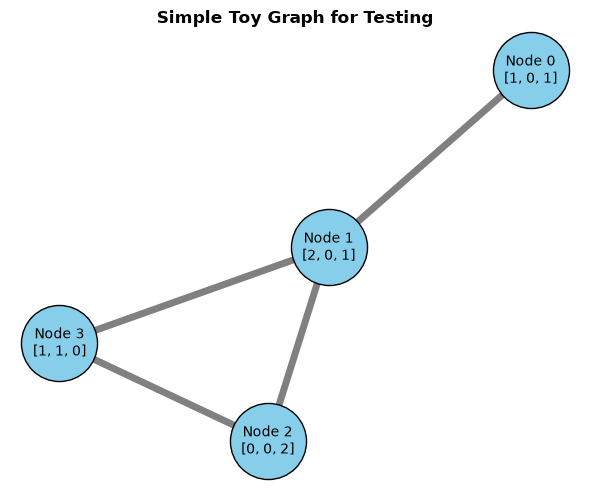
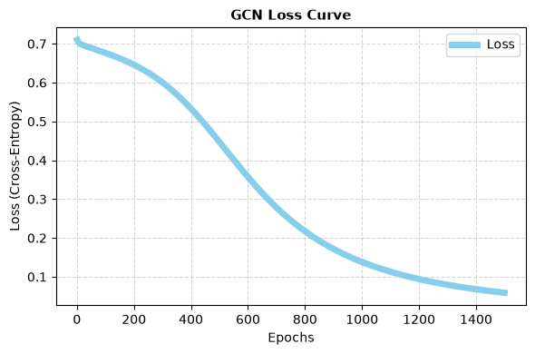
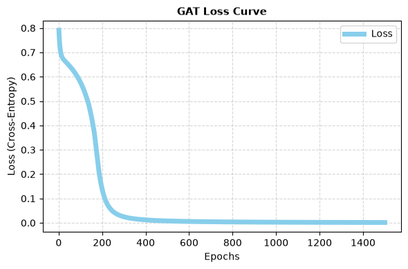

# GNN From Scratch
This study project is dedicated to implementing classic models of GNNs for Node Classification via Message Passing framework (Message, Aggregate, Update/Combine) using just NumPy and Autograd for weight optimization.

Both models were structured with 2 layers with an activation function at the first layer (LeakyReLU for GCN and ELU for GAT), trained by pure Stochastic Gradient Descent (SGD) with Cross Entropy as the loss function and normalized by a Softmax function at the final layer.

## Message Passing
The Message Passing paradigm was formalized by Gilmer et al. (2017) through the Message Passing Neural Networks (MPNNs) framework, which unified various existing graph architectures under the abstract functions of Message and Update. The literature later consolidated this abstraction into the Message, Aggregate, and Combine (or Update) steps - a notation widely used by subsequent works, such as Xu et al. (2019), to mathematically analyze and prove the expressive power of GNNs.

This process can be broken down into three main phases for a given target node:

1. **Message**: Each neighbor of the target node generates a message based on its current features.
2. **Aggregate**: The target node gathers and aggregates the messages from its entire neighborhood using a permutation-invariant function (e.g., SUM, MEAN, MAX).
3. **Update (Combine)**: The target node combines its own previous representation with the aggregated neighborhood messages to compute its new representation for the next layer.

In this project, a base `MessagePassing` class was developed to encapsulate this exact workflow.

## Graph Convolutional Networks (GCN)
As one of the foundational GNN architectures, it utilizes the theory of Spectral Graph Convolutions to achieve an optimized way to obtain Node Representations (Embeddings). Applied here to a Node Classification task, though its underlying logic is highly relevant for various other domains. In the original paper (Kipf & Welling, 2017), they present the following matrix form of the propagation rule for GCNs:

$$\mathbf{H}^{(l+1)} = \sigma \left( \tilde{\mathbf{D}}^{-\frac{1}{2}} \tilde{\mathbf{A}} \tilde{\mathbf{D}}^{-\frac{1}{2}} \mathbf{H}^{(l)} \mathbf{W}^{(l)} \right)$$

In the original modeling, the proposed GCN had a traditional ReLU as the activation function at the first layer. However, in this project, due to the Dead ReLU phenomenon, LeakyReLU was chosen instead and a bias vector was added.

## Graph Attention Networks (GAT)
As another classic GNN architecture, GATs utilize the attention mechanism - widely applied in other AI fields such as NLP - to determine the importance of each node in the neighborhood, dynamically weighting their features to compute a more robust node representation. Again, we applied it here for Node Classification task, though its versatility. In the original paper (Veličković et al, 2018), it's presented that we can calculate the attention coefficients with the following architecture:

$$\alpha_{ij} = \frac{\exp \left( \text{LeakyReLU} \left( \mathbf{a}^T [ \mathbf{W}h_i \\| \mathbf{W}h_j ] \right) \right)}{\sum_{k \in \mathcal{N}_i} \exp \left( \text{LeakyReLU} \left( \mathbf{a}^T [ \mathbf{W}h_i \\| \mathbf{W}h_k ] \right) \right)}$$

With the new node representation being acquired by applying:

$$h_i' = \sigma \left( \sum_{j \in \mathcal{N}_i} \alpha_{ij} \mathbf{W}h_j \right)$$

## Results
In order to test the implemented models, a toy graph dataset was created as well as an arbitrary Node Features Matrix and a Target One-Hot Encoding Matrix with class indexes as [0, 0, 1, 1]. The corresponding graph with the node features included is represented in the following image:

<p align="center">
  
</p>

One thing to notice is that the node disposition was planned so that Node 2 and 3 should be symmetrical (after adding self-loops they became identical in the Adjacency Matrix). So, the final outputs should be equal because of that symmetry and the way Message Passing works.

The results were perfect, both models worked as expected and the nodes were accurately classified w.r.t. their ground truth, suggesting the successful implementation of both GNN models from scratch. Below, the numerical results and the Loss Curves for each model are presented:

### Numerical Predictions Comparison

| Node | Ground Truth | GCN (Class 0 / Class 1) | GAT (Class 0 / Class 1) |
| :---: | :---: | :---: | :---: |
| **0** | Class 0 | 0.9978 / 0.0022 | 0.9992 / 0.0008 |
| **1** | Class 0 | 0.9002 / 0.0998 | 0.9990 / 0.0010 |
| **2** | Class 1 | 0.0616 / 0.9384 | 0.0022 / 0.9978 |
| **3** | Class 1 | 0.0616 / 0.9384 | 0.0022 / 0.9978 |

The GAT model demonstrates a higher confidence in its predictions, illustrating the impact of the dynamic attention mechanism over static routing.

### Loss Curves

<p align="center">
  
  &nbsp; &nbsp; &nbsp; &nbsp;
  
</p>

The main difference between the loss curves of GCN and GAT comes down to the level of freedom and how each model perceives the graph structure:

- **GCN (Smooth Convergence)**: Operates with a static topology. Since the adjacency matrix is predefined and immutable, the model optimizes only the representation weights (features). This creates a restricted learning environment, acting as a natural regularizer that results in a gradual and highly stable descent over the epochs.

- **GAT (Abrupt/Accelerated Convergence)**: Operates with a dynamic topology. Through the attention mechanism, the model recalculates the importance of each neighbor at every iteration, simultaneously optimizing the features and the connection structure. This allows the model to find shortcuts and solve simple graphs quickly, but it adds complexity and potential instability when optimizing real and noisy graphs.

To solve this instability when dealing with complex and noisy real-world graphs, the GAT architecture introduces Multi-Head Attention, which computes multiple independent attention mechanisms in parallel and aggregates their results, effectively stabilizing the dynamic learning process.

## Project Structure

The repository is structured to be modular and scalable. The core logic relies on a base `MessagePassing` class, making it straightforward to expand from Graph Convolutional Networks (GCNs) to Graph Attention Networks (GATs) and other architectures.

```text
.
├── data/                  # Graph dataset
├── images/                # Assets and plots used in the README documentation
├── src/                   # Source code
│   ├── layers.py          # Message Passing base class, GCN and GAT layers
│   ├── models.py          # GNN model architectures
│   └── utils.py           # Helper functions and mathematical operations
├── training.ipynb         # GCN and GAT Training and evaluation notebook
├── requirements.txt       # Project dependencies
└── README.md
```

## Requirements
- **Python 3.11+**
- The project relies on standard data science libraries and HIPS Autograd for automatic differentiation. All dependencies are listed in the `requirements.txt` file.

To install the dependencies, run the following command in your terminal:

```bash
pip install -r requirements.txt
```

## How to Run
- **Clone the repository:**
```bash
git clone <your-repository-url>
cd <repository-folder>
```
- **Set up your environment:**

    Ensure you have the required dependencies installed (see Requirements above).

- **Launch the notebooks:**
    
    Open the Jupyter Notebook files to interact with the models:
```bash
jupyter notebook
```

- **Run the experiments:**

    Open `training.ipynb`.

    Execute all cells to train both the GCN and GAT models from scratch and visualize the final results.
